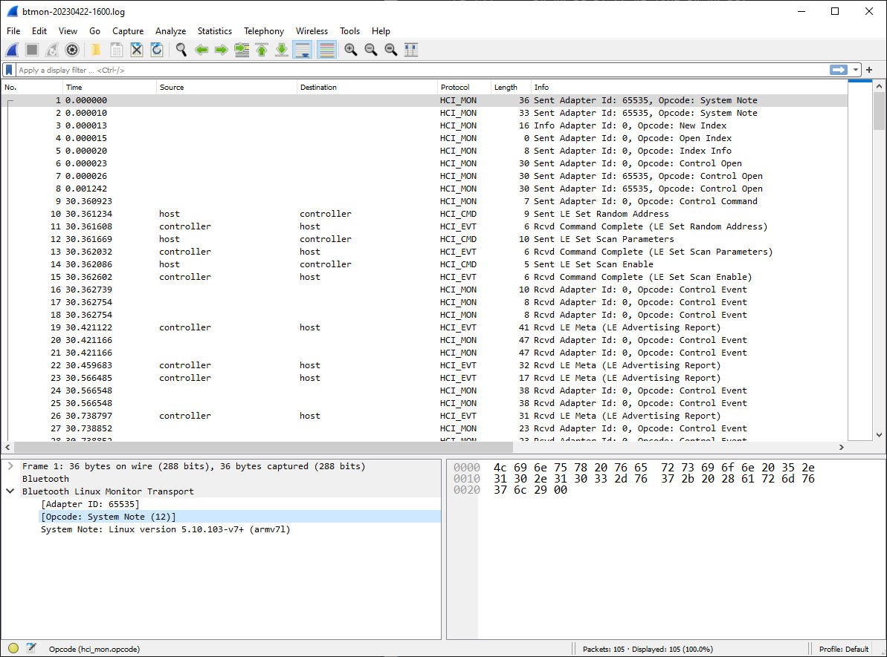

NOTE: **WORK-IN-PROGRESS**

This post explains how to capture Bluetooth Low Energy packets using Open Source tools.

Launch `btmon` on the host acting as central. In our case this is a Raspberry Pi 3B+

```bash
sudo btmon -w btmon-20230422-1600.log
```

Now open another terminal and interact with the target of interest.

For instance, launch `bluetoothctl` and type the following commands:

```bash
scan on
scan off
connect D0:99:BC:DA:66:9F
connect D0:99:BC:DA:66:9F
exit
```

Result:

```text
pi@rpi3pgm29:~ $ bluetoothctl
Agent registered
[bluetooth]# scan on
Discovery started
[CHG] Controller B8:27:EB:A3:CA:84 Discovering: yes
[NEW] Device 32:EA:0A:94:14:46 32-EA-0A-94-14-46
[NEW] Device 4B:D7:0C:ED:9A:9F 4B-D7-0C-ED-9A-9F
[CHG] Device D0:99:BC:DA:66:9F RSSI: -47
[NEW] Device 6A:E5:9A:F9:9C:39 6A-E5-9A-F9-9C-39
[NEW] Device 67:58:28:56:38:79 67-58-28-56-38-79
[NEW] Device 3C:CA:D2:50:9A:9B 3C-CA-D2-50-9A-9B
[NEW] Device 67:28:E6:A6:14:58 67-28-E6-A6-14-58
[CHG] Device DE:13:06:8D:1A:5D RSSI: -44
[NEW] Device 4D:BC:5D:4F:7C:4E 4D-BC-5D-4F-7C-4E
[NEW] Device 4F:63:A0:CC:4E:12 4F-63-A0-CC-4E-12
[bluetooth]# scan off
Discovery stopped
[CHG] Controller B8:27:EB:A3:CA:84 Discovering: no
[CHG] Device 4F:63:A0:CC:4E:12 TxPower is nil
[CHG] Device 4F:63:A0:CC:4E:12 RSSI is nil
[CHG] Device 4D:BC:5D:4F:7C:4E TxPower is nil
[CHG] Device 4D:BC:5D:4F:7C:4E RSSI is nil
[CHG] Device DE:13:06:8D:1A:5D RSSI is nil
[CHG] Device 67:28:E6:A6:14:58 TxPower is nil
[CHG] Device 67:28:E6:A6:14:58 RSSI is nil
[CHG] Device 3C:CA:D2:50:9A:9B RSSI is nil
[CHG] Device 67:58:28:56:38:79 RSSI is nil
[CHG] Device 6A:E5:9A:F9:9C:39 TxPower is nil
[CHG] Device 6A:E5:9A:F9:9C:39 RSSI is nil
[CHG] Device D0:99:BC:DA:66:9F RSSI is nil
[CHG] Device 4B:D7:0C:ED:9A:9F TxPower is nil
[CHG] Device 4B:D7:0C:ED:9A:9F RSSI is nil
[CHG] Device 32:EA:0A:94:14:46 RSSI is nil
[bluetooth]# connect D0:99:BC:DA:66:9F
Attempting to connect to D0:99:BC:DA:66:9F
[CHG] Device D0:99:BC:DA:66:9F Connected: yes
Failed to connect: org.bluez.Error.Failed
[CHG] Device D0:99:BC:DA:66:9F Connected: no
[bluetooth]# connect D0:99:BC:DA:66:9F
Attempting to connect to D0:99:BC:DA:66:9F
[CHG] Device D0:99:BC:DA:66:9F Connected: yes
Failed to connect: org.bluez.Error.Failed
[CHG] Device D0:99:BC:DA:66:9F Connected: no
[bluetooth]# exit
pi@rpi3pgm29:~ $
```

From the terminal where you launched `btmon` you should see messages exchanged between the Bluetooth host (i.e. the Raspberry Pi) and the Bluetooth controller.

```text
...
```

When you are satisfied with the results, type `^C` to stop btmon and look at the btsnoop file that has been created:

```text
pi@rpi3pgm29:~ $ ls -la btmon-20230422-1600.log
-rw-r--r-- 1 root root 4690 Apr 22 16:02 btmon-20230422-1600.log
pi@rpi3pgm29:~ $
```

In our case the Raspberry Pi has no display, so you need to dowload file `btmon-20230422-1600.log` from a PC where we have Wireshark installed.

```text
gmaca@alpha MINGW64 ~/Downloads
$ scp rpi3pgm29:btmon-20230422-1600.log .
btmon-20230422-1600.log                                               100% 4690   339.5KB/s   00:00

gmaca@alpha MINGW64 ~/Downloads
$
```

You may now open the file from Wireshark:



You may apply some display filters, for instance the [btatt](https://www.wireshark.org/docs/dfref/b/btatt.html)

Wireshark: Analyze > Display Filters...

- Filter: `btatt`

<!-- EOF -->
