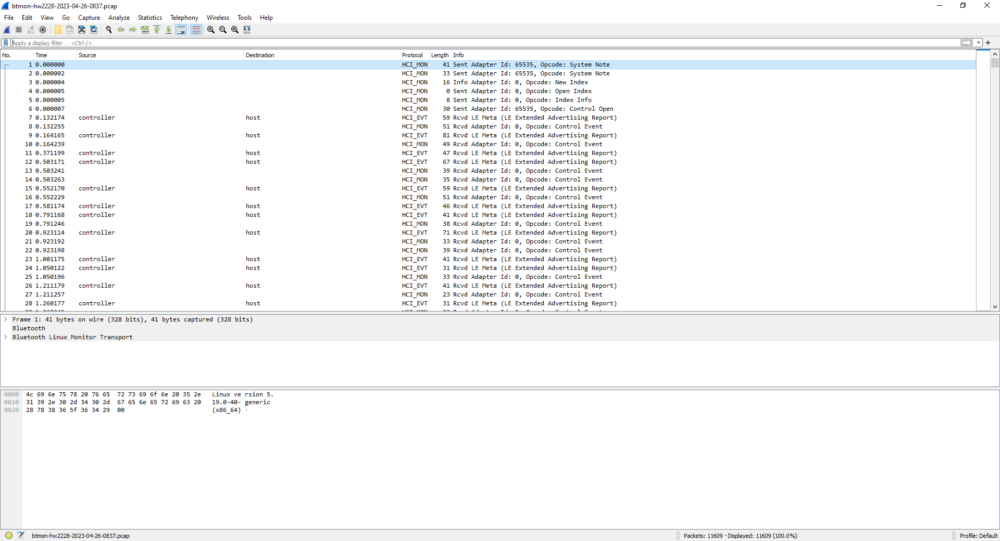
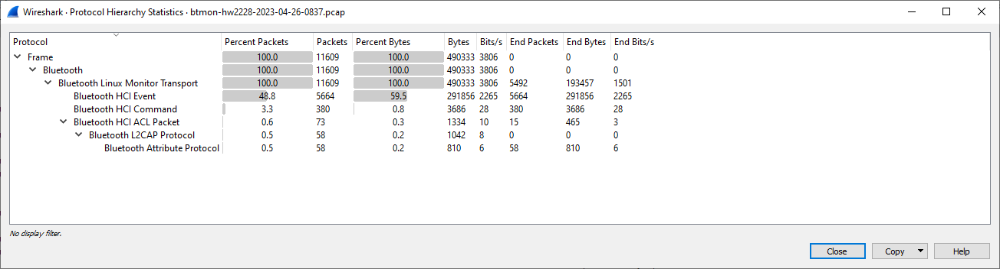
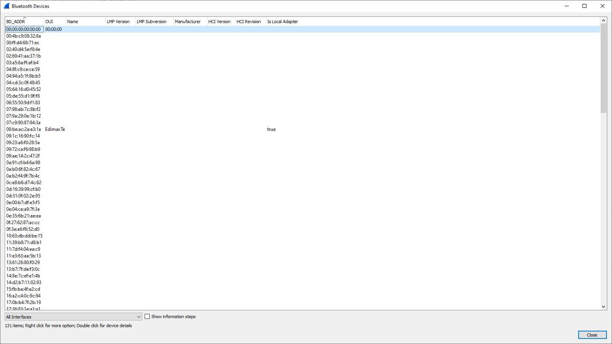
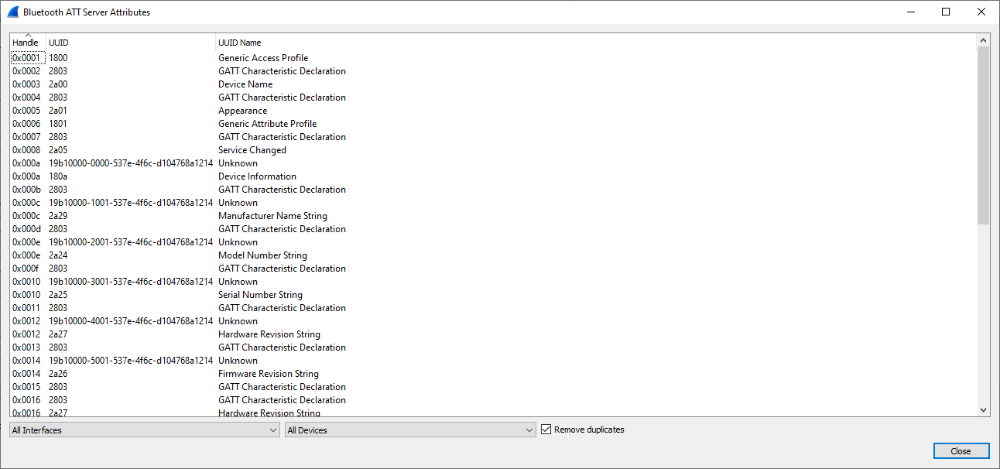
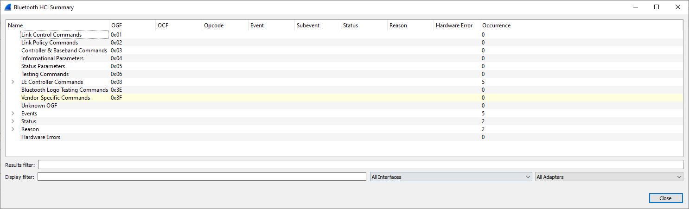
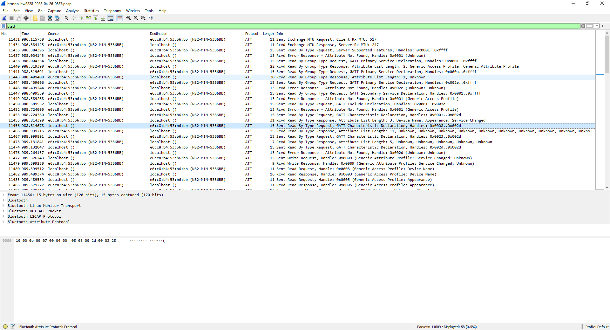

This post explains how to capture Bluetooth Low Energy packets using Open Source tools.

## Prerequisites

- A host acting as BLE central with the following characteristics:
  - OS: a recent Debian or Ubuntu distribution (tested on a [Raspberry Pi 3B+](https://www.raspberrypi.com/products/raspberry-pi-3-model-b-plus/) running [Raspberry Pi OS](https://www.raspberrypi.com/software/) bullseye)
  - Package `bluez-utils` installed
  - A Bluetooth Low Energy adapter supported by the Linux host (tested with the on-board Bluetooth interface of the Raspberry Pi)
- [Wireshark](https://www.wireshark.org/) installed either on the Linux host or on another machine (in this case the OS may also be Windows or macOS)

## Step-by-step instructions

### Create BT Snoop file using btmon

Launch `btmon` on the host acting as BLE central. In our example, open a terminal on the Raspberry Pi and type the following command:

```bash
sudo btmon -w btmon-$(uname -n)-$(date '+%Y%m%d-%H%M').log
```

This command will create a timestamped file, for instance `btmon-rpi3pgm29-20230422-1600.log`.
The format of the file is similar to
[Android btsnoop_hci.log](https://source.android.com/docs/core/connect/bluetooth/verifying_debugging).

Now open another terminal and interact with the BLE device of interest.
For instance, launch `bluetoothctl`

```bash
bluetoothctl
```

and type the following commands:

```bash
scan on
scan off
connect D0:99:BC:DA:66:9F
connect D0:99:BC:DA:66:9F
exit
```

Result:

```text
pi@rpi3pgm29:~ $ bluetoothctl
Agent registered
[bluetooth]# scan on
Discovery started
[CHG] Controller B8:27:EB:A3:CA:84 Discovering: yes
[NEW] Device 32:EA:0A:94:14:46 32-EA-0A-94-14-46
[NEW] Device 4B:D7:0C:ED:9A:9F 4B-D7-0C-ED-9A-9F
[CHG] Device D0:99:BC:DA:66:9F RSSI: -47
[NEW] Device 6A:E5:9A:F9:9C:39 6A-E5-9A-F9-9C-39
[NEW] Device 67:58:28:56:38:79 67-58-28-56-38-79
[NEW] Device 3C:CA:D2:50:9A:9B 3C-CA-D2-50-9A-9B
[NEW] Device 67:28:E6:A6:14:58 67-28-E6-A6-14-58
[CHG] Device DE:13:06:8D:1A:5D RSSI: -44
[NEW] Device 4D:BC:5D:4F:7C:4E 4D-BC-5D-4F-7C-4E
[NEW] Device 4F:63:A0:CC:4E:12 4F-63-A0-CC-4E-12
[bluetooth]# scan off
Discovery stopped
[CHG] Controller B8:27:EB:A3:CA:84 Discovering: no
[CHG] Device 4F:63:A0:CC:4E:12 TxPower is nil
[CHG] Device 4F:63:A0:CC:4E:12 RSSI is nil
[CHG] Device 4D:BC:5D:4F:7C:4E TxPower is nil
[CHG] Device 4D:BC:5D:4F:7C:4E RSSI is nil
[CHG] Device DE:13:06:8D:1A:5D RSSI is nil
[CHG] Device 67:28:E6:A6:14:58 TxPower is nil
[CHG] Device 67:28:E6:A6:14:58 RSSI is nil
[CHG] Device 3C:CA:D2:50:9A:9B RSSI is nil
[CHG] Device 67:58:28:56:38:79 RSSI is nil
[CHG] Device 6A:E5:9A:F9:9C:39 TxPower is nil
[CHG] Device 6A:E5:9A:F9:9C:39 RSSI is nil
[CHG] Device D0:99:BC:DA:66:9F RSSI is nil
[CHG] Device 4B:D7:0C:ED:9A:9F TxPower is nil
[CHG] Device 4B:D7:0C:ED:9A:9F RSSI is nil
[CHG] Device 32:EA:0A:94:14:46 RSSI is nil
[bluetooth]# connect D0:99:BC:DA:66:9F
Attempting to connect to D0:99:BC:DA:66:9F
[CHG] Device D0:99:BC:DA:66:9F Connected: yes
Failed to connect: org.bluez.Error.Failed
[CHG] Device D0:99:BC:DA:66:9F Connected: no
[bluetooth]# connect D0:99:BC:DA:66:9F
Attempting to connect to D0:99:BC:DA:66:9F
[CHG] Device D0:99:BC:DA:66:9F Connected: yes
Failed to connect: org.bluez.Error.Failed
[CHG] Device D0:99:BC:DA:66:9F Connected: no
[bluetooth]# exit
pi@rpi3pgm29:~ $
```

The messages exchanged between the Bluetooth host (i.e. the Raspberry Pi) and the Bluetooth controller will be logged on the terminal where you executed the `btmon` command.

<!-- TODO: Screenshot -->

When you are satisfied with the results, type `^C` to stop btmon and look at the btsnoop file that has been created:

```text
pi@rpi3pgm29:~ $ ls -la btmon-rpi3pgm29-20230422-1600.log
-rw-r--r-- 1 root root 4690 Apr 22 16:02 btmon-rpi3pgm2920230422-1600.log
pi@rpi3pgm29:~ $
```

### Analyze BLE packets using Wireshark

In our case the Raspberry Pi has no display, so we need to download file `btmon-hw2228-2023-04-26-1328.pcap` from a PC where we have Wireshark installed.

```text
gmaca@alpha MINGW64 ~/Downloads
$ scp rpi3pgm29:btmon-rpi3pgm29-20230422-1600.log .
btmon-rpi3pgm29-20230422-1600.log                                               100% 4690   339.5KB/s   00:00

gmaca@alpha MINGW64 ~/Downloads
$
```

You may now open the file from Wireshark:

Launch [Wireshark Portable](https://www.wireshark.org/docs/wsdg_html_chunked/ChToolsPortableApps.html)

Wireshark: File > Open

- Filename: `btmon-hw2228-2023-04-26-0837.pcap`



Some useful commands to understand which packets have been captured are the following

#### Display Protocol Hierarchy

Wireshark: Statistics > Protocol Hierarchy



#### Display Bluetooth Devices

Wireshark: Wireless > Bluetooth Devices



#### Display Bluetooth ATT Server Attributes

Wireshark: Wireless > Bluetooth ATT Server Attributes



#### Display Bluetooth HCI Summary

Wireshark: Wireless > Bluetooth HCI Summary



#### Display Filter: btatt

Wireshark provides a few useful display filters.

For instance, with [btatt](https://www.wireshark.org/docs/dfref/b/btatt.html) (Bluetooth Attribute Protocol) you can list the services and characteristics supported by the target BLE device.

Wireshark: Analyze > Display Filters

- Filter: `btatt`



<!-- EOF -->
