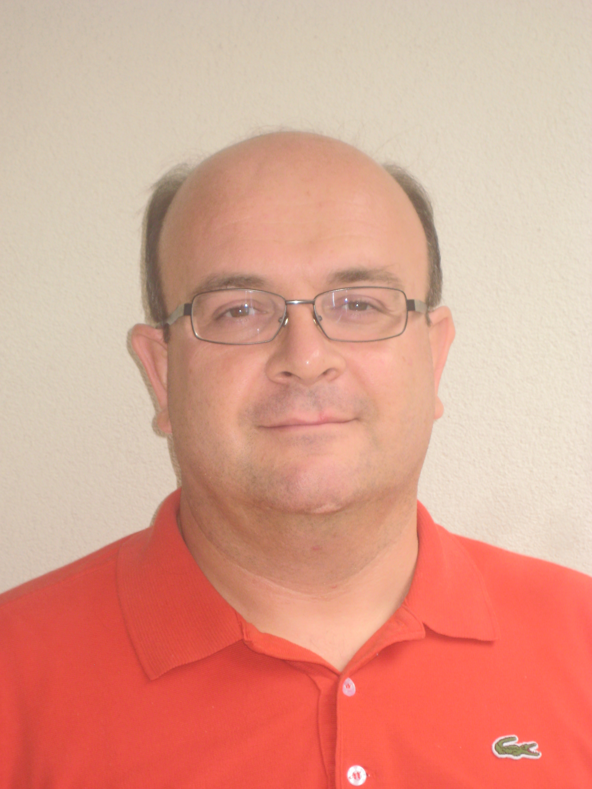

Gianpaolo Macario - Bio
=======================

Gianpaolo Macario is a senior member of the Embedded Software division of [Mentor Graphics](http://www.mentor.com/embedded-software).

Before joining Mentor Graphics, he was the System Architect responsible for the Linux-based platform development at [Magneti Marelli](http://www.magnetimarelli.com).

Gianpaolo has been working with Embedded Linux and In-Vehicle Infotainment for the last several years and had the privilege of seeing and helping Linux evolve from a crazy idea to a solid foundation for In-Vehicle Infotainment.

Gianpaolo has been involved in the [GENIVI Alliance](http://www.genivi.org/) right since its inception, and has been serving as lead Architect of the System Infrastructure Expert Group since January 2012.

Gianpaolo has co-authored a few research papers and has given several presentations about Linux and IVI to customers, universities and other public events.

Contacts
--------

* Follow Gianpaolo on LinkedIn: <http://it.linkedin.com/in/gmacario/>
* Follow Gianpaolo on Twitter: <http://twitter.com/gpmacario>
